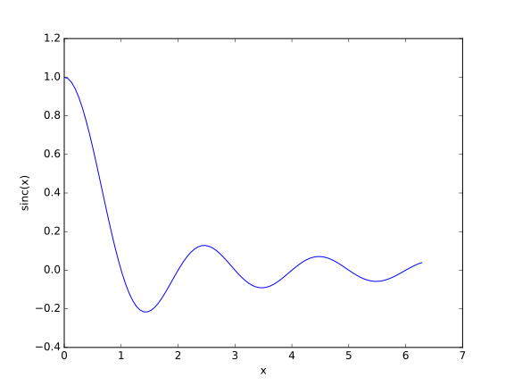
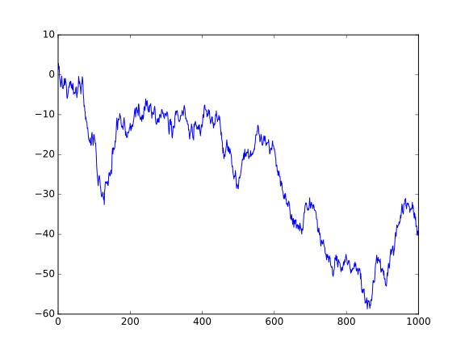

# Introducion to Weave

This a sample [Julia](http://julialang.org/) noweb document that can
be executed using Weave. Output from code chunks and PyPlot
plots will be included in the weaved document. You also need to install Pweave from Github in order to use Weave.

This documented can be turned into Pandoc markdown with captured
result from Julia prompt.

~~~~{.julia}
using Weave
weave("examples/julia_sample.mdw")
~~~~

## Terminal chunk

````julia
julia> x = 1:10

1:10
julia> d = Dict("Weave" => "testing")

Dict{String,String} with 1 entry:
  "Weave" => "testing"
julia> y = [2, 4 ,8]
3-element Array{Int64,1}:
 2
 4
 8
````


## Capturing figures

The figures and code can be included in the output.

````julia
using PyPlot
t = linspace(0, 2*pi, 100)
plot(t, sinc(t))
xlabel("x")
ylabel("sinc(x)")
````


````
PyObject <matplotlib.text.Text object at 0x7fa4afb91a20>
````


\ 


You can also include a plot with caption and hide the code:

````
1-element Array{Any,1}:
 PyObject <matplotlib.lines.Line2D object at 0x7fa4d272bd30>
````



